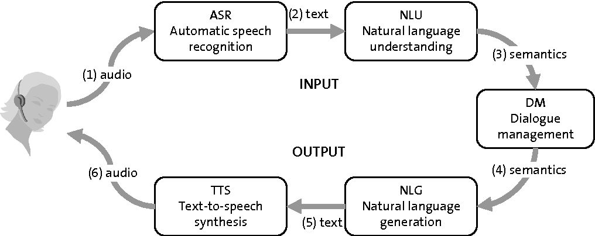
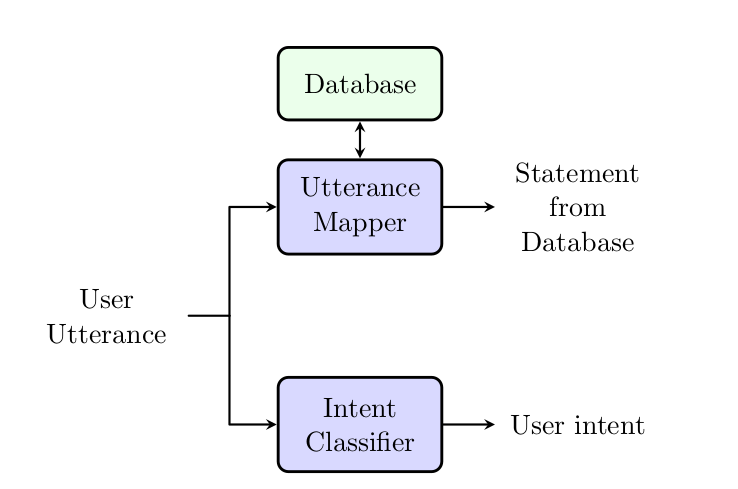

== Natural Language Understanding in Argumentative Dialogue Systems

This repository contains the python scripts for various natural language
processing models which I worked on my master's thesis
link:https://oparu.uni-ulm.de/xmlui/handle/123456789/23779[ Natural Language
Understanding in Argumentative Dialogue System]

=== Introduction
The following figure shows the general structure of a
dialogue system (DS).

.General design of a dialogue system. Source : https://www.semanticscholar.org/paper/Spoken-Dialogue-Systems-2.1-Classifications-of/7a3c58ef132157da8e8de0f2ca2ca4c4fffdb9ef

Automatic Speech Recognition (ASR) converts the user speech
to the text. The text is then analyzed and understood in Natural Language
Understanding (NLU). Dialogue manager keeps track of the input and the corresponding
responses. Natural Language Generation (NLG) generates the appropriate responses,
which are converted to the speech by text to speech. The goal of the thesis is to
implement NLU for an argumentative DS. The following figure
shows the NLU structure.

.Design of Natural Language Understanding module in an argumentative dialog system. This consists three components,utterance mapper, database and intent classifier. Source : <<pavan>>

The NLU design is influenced by the way humans understand an utterance in a discussion.
In a discussion, we argue based on our knowledge base about the topic. Richer the
information we have, better is the quality of the argument. Moreover, the responses
also depend on the intention of the opponent. For example, we respond differently for
opponents trying to concede, argue, or retract.

The design consist of an utterance mapper, a database and an intent classifier.
The database contains arguments about a topic.
The utterance mapper finds the sentence closest to the user utterance in the Database.
Intent classifier detects the move played by the user in an argument game.
A user can have four types moves or the intents, argue, why(asking for more information
about the previous statement ), retract and concede.
Both these outputs are needed to synthesize the response.

The utterance mapper is implemented by various models like
the ones which exploit the linguistic properties of the English language such as,
WordNet, models which rely on the vector representation of words like GloVe, BERT.
The performance of these models are measured with different similarity measurement
techniques. The similarity measurement techniques include various distance
measurements and certain aspects of IBM project debater.

We use the sample Wikipedia dataset released by
link:http://www.research.ibm.com/haifa/dept/vst/debating_data.shtml[IBM project debater]
to train GloVe. BERT trained model is downloaded from the
link:https://github.com/google-research/bert[Google release]. WordNet model is
downloaded from the NLTK package.

For the performance measurement of GloVe, BERT, WordNet and similarity
measurement techniques of IBM project debater, we convert this dataset into
a dataset of sentence triplets. A sentence triplet is a set of three sentences
where two sentences are semantically closer than the third. A successfully trained
model should identify the relation between the triplets.

Intent classification is implemented by the chat bot designs such as RASA.

The database is constructed according to <<rach>>. It contains a sample debate
from the database of link:https://idebate.org/debatabase[idebate.org].
Idebate.org is operated by the International Debate
Education Association (IDEA), a global Network of organisations who educate people
in debate.

=== Pre requisites
The following packages are needed to run the scripts.

* Tensorflow 1.13.0
* Numpy
* NLTK
* BERT server and BERT client
* Progressbar

It is recommended to install these packages inside a virtual environment.
Create a new virtual environment by choosing a Python3 interpreter and making
a ./venv directory to hold it:

[source, bash]
----
$ virtualenv --system-site-packages -p python3 ./venv
----

Activate the virtual environment

[source, bash]
----
$ source ./venv/bin/activate
----

Install all the necessary packages.
[source, bash]
----
$ (venv) $ pip3 install -r requirements.txt
----

=== Dataset

The scripts depend on /Training_Data/dataset.csv from
link:http://www.research.ibm.com/haifa/dept/vst/debating_data.shtml[IBM project debater]
for training and validating the models. This data set contains 692 Wikipedia
pages of May 2017 where, article title, section title and sentences are arranged in a
CSV format. This data set is transformed into triplet sentences and triplet titles according
to <<ibm>> (Can be found in /Training_Data/triplets). Following table summarizes the
triplet counts generated From `dataset.csv`.

[%header,cols=3]
|===
|Triplet category
|Triplet sentence count
|Triplet titles count

|Train
|1860274
|64440

|Validation
|232962
|8079

|Test
|231902
|7965

|Total count
|2325138
|80484

|Grand total
2+^|2405622

|===

[bibliography]
== References
- [[[pavan,1]]] Shigehalli, Pavan Rajashekhar (2020): Natural language understanding
  in argumentative dialogue systems. Open Access Repositorium der Universität Ulm.
  http://dx.doi.org/10.18725/OPARU-23716
- [[[ibm,2]]] Liat Ein Dor , Yosi Mass , Alon Halfon, Elad Venezian,
  Ilya Shnayderman, Ranit Aharonov and Noam Slonim "Learning Thematic Similarity
  Metric Using Triplet Networks", Proceedings of the 56th Annual Meeting of the
  Association for Computational Linguistics (Short Papers), pages 49–54
  Melbourne, Australia, July 15 - 20, 2018.
- [[[rach,3]]] Wolfgang Minker Niklas Rach, Saskia Langhammer and Stefan Ultes. Utilizing
  argument mining techniques for argumentative dialogue systems. In In Proceedings
  of the 9th International Workshop On Spoken Dialogue Systems (IWSDS), 2018.
